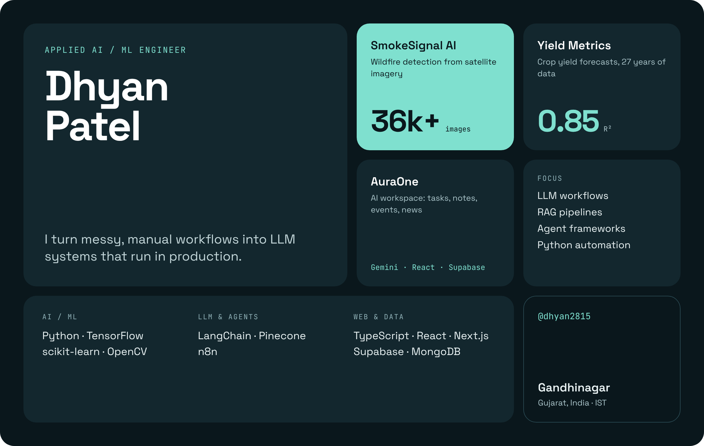

<!-- PROFILE CARD — source: design/profile-card.html · re-render: python design/render.py -->

  

<!-- Image regions aren't clickable on GitHub, so the project links live here -->

  <a href="https://github.com/dhyan2815/SmokeSignal-AI">SmokeSignal AI</a> &nbsp;·&nbsp;
  <a href="https://github.com/dhyan2815/Crop-Yield-Prediction">Yield Metrics</a> &nbsp;·&nbsp;
  <a href="https://github.com/dhyan2815/AuraOne">AuraOne</a>

